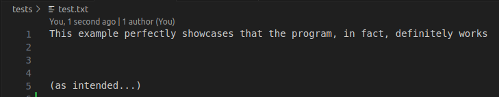
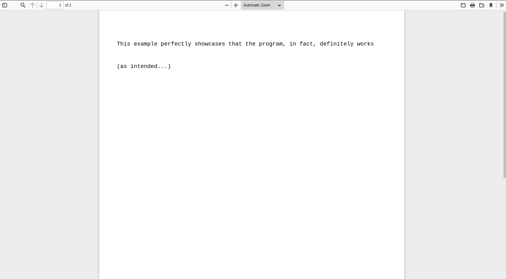

# text-to-pdf
### A one file C program to help you convert a txt file to pdf.

### Informations on the structure of PDF : 

- I used these two links to inspire my work : [here](https://www.oreilly.com/library/view/pdf-explained/9781449321581/ch04.html) and [here](https://pypdf2.readthedocs.io/en/3.0.0/dev/pdf-format.html).

### __What does it do ?__
- As you might have guessed it, given a filepath as input, it generates the necessary code to convert it to a PDF file. 
<br />


### __Requirements__
- Obviously, a C compiler. I tested the program with both gcc (version 11.3) and clang, but really any decent C compiler should be ok running this. It only requires C89 functions, so I'd hope you don't use an older version of C.


### __How to install it on your computer ?__

```ps
git clone https://github.com/Esteban795/text-to-pdf.git
```
or whatever you want. Download it directly from Github if you'd prefer so.
<br/>
- From there, you can just run (in the right directory of course) : 
```ps
make build
```
and then, use the program as you wish :

```ps
./bin/text-to-pdf [yourInputFile]
```
- It should print you the actual PDF source code to stdin. I'm still working on a way to let you give the program an output file and overwrites what's already in them.
<br/>
<br/>

### Example 
- Here is a quick example, with an input file located in `tests/test.txt` directory : 


- After running the command and opening the PDF file, you should have this : 


Here it is !

### Objectives 

- ~~Write directly to an output file.~~ ✅
- Do the other way : pdf-to-text ! 